# Task 3: 도서 대출 관리 프로그램 만들기 (Part 1)  

## Use case: 
- Copilot에게 Custom instruction을 제공하여 원하는 형태로 코드 제안을 받습니다.
- Copilot Chat의 다양한 모드 (Ask, Edit, Agent)를 활용하여 프로그램을 구성합니다.

## 목표:
- 실제 도서대출 관리 프로그램을 빌드하면서 GitHub Copilot의 다양한 기능을 활용하는 방법을 익힙니다.
- 기본 GPT-4o 모델 외에, 다른 모델을 활용해 봅니다. 
- Copilot에게 Custom instruction을 제공하여 원하는 형태로 코드 제안을 받는 방법을 익힙니다.
- Copilot chat의 'Ask', 'Edit', 'Agent' 모드를 각각 활용하여 모듈을 구성해 보고, 차이점을 이해합니다.


## Step 1: Custom instructions 생성
 - **[Custom instructions란](https://code.visualstudio.com/docs/copilot/copilot-customization)** 
    - Copilot에게 특정한 컨텍스트를 제공하여, 원하는 형태로 코드 제안을 받는 방법입니다. 
    - 예를 들어, 특정한 스타일의 코드를 제안받고 싶거나, 특정한 언어로 코드를 제안받고 싶을 때 사용합니다. 
    - Custom instructions는 다양한 형태로 작성할 수 있습니다. 
    
      - [.github/copilot-instructions.md 파일로 작성](https://docs.github.com/en/enterprise-cloud@latest/copilot/customizing-copilot/adding-repository-custom-instructions-for-github-copilot?tool=vscode) <br>
         - VS Code의 설정에서 관련 설정을 활성화 <br>
          
          <br>
         - [Copilot instructions](src/copilot-instructions.md)를 작성합니다.  <br>
          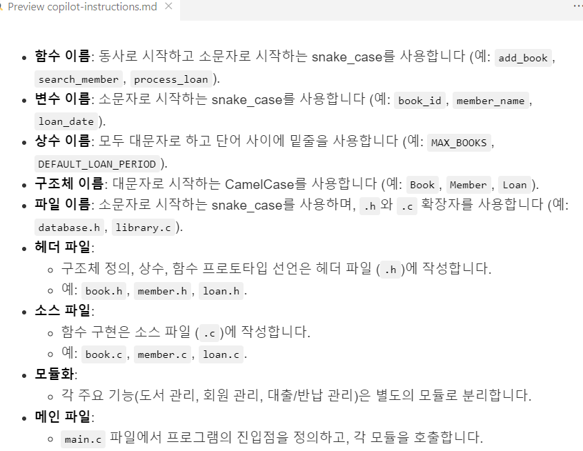

      - VS Code의 User setting, 혹은 Workspace setting을 하는 JSON파일에 Text 혹은 File로 형식으로 작성되며, VS Code의 settings.json 파일에 추가됩니다.

          - 프로젝트에 `/docs` 디렉토리를 생성합니다. 
          - 예제로 주어진 /docs 디렉토리의 파일들을 복사하여, 실습중인 프로젝트에 붙여 넣습니다. <br>
            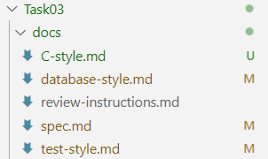
          - 붙여넣어진 파일들의 내용을 확인하고, 별도로 원하는 내용이 있을 경우 수정해 봅니다. 

          - `Ctrl + Shift + P`를 눌러 명령어 팔레트를 열고, `Preference: Open Workspace Settings (JSON)`을 선택합니다. <br>
            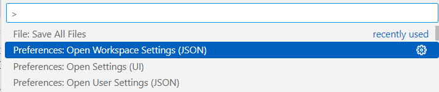

          - settings.json 파일에 "github.copilot.chat.codeGeneration.instructions"을 추가합니다. <br>
          ```json
          {
            "github.copilot.chat.codeGeneration.instructions": [
                  {
                      "file": "docs/spec.md"
                  },
                  {
                      "file": "docs/C-style.md"
                  },
                  {
                      "file": "docs/database-style.md"
                  },
                  {
                      "file": "docs/test-style.md"
                  }
              ]
          }
          ```
    
- Copilot Chat에 `이 프로젝트를 구성하려면 어떻게 해야하는지 알려줘` 라고 질문한뒤, custom instructions의 파일들이 참조로 추가되는지 확인한다. <br>
   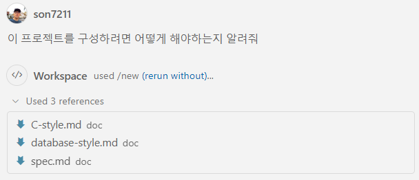


## Step 2: 프로그램 생성 다이어 그램 요청

- 모델을 변경합니다. `Claude 3.7 Sonnet` 모델을 선택합니다. <br>

- `이 프로젝트의 다이어그램을 생성해 줘` 라고 질문하여 프로젝트 구조를 확인합니다. <br>
  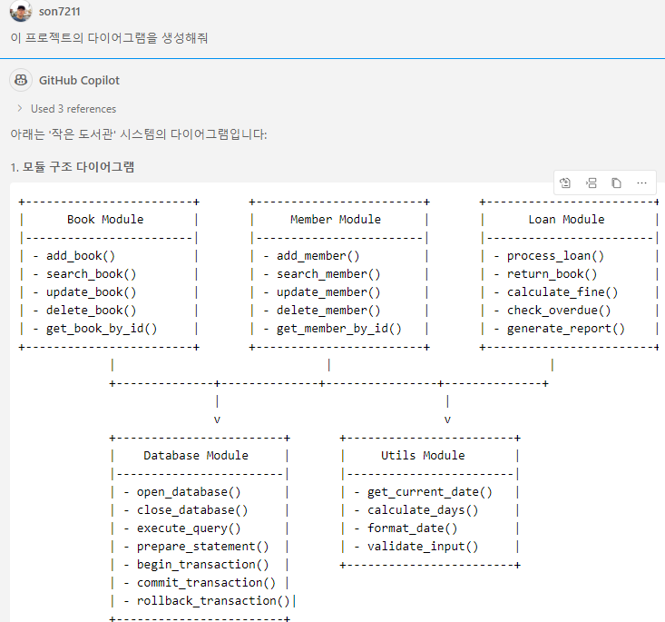
  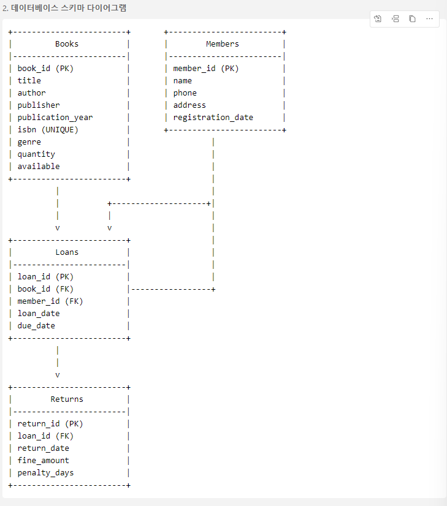
  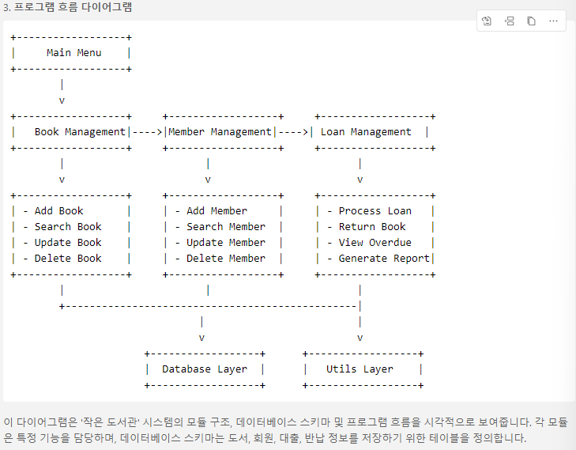

## Step 3: database 모듈 생성

- 먼저 `include` 디렉토리를 만들고, `database.h`파일을 생성합니다. <br>
- Copilot Chat의 `Ask` 모드에서 `database 헤더 파일에 함수들을 선언해 줘` 라고 요청합니다. <br>
  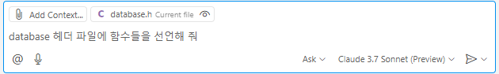

- 제안받은 내용을 확인하고, 파일에 추가합니다. <br>
  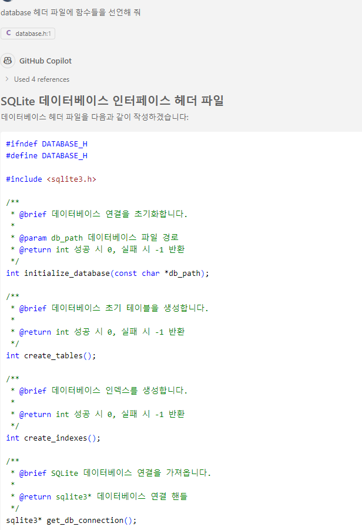

- `src` 디렉토리를 만들고, `database.c`파일을 생성합니다. <br>
- Copilot Chat에 '`database 소스 파일에 함수들을 정의해 줘`' 라고 요청합니다. 이 때, 위에서 작성된 `database.h`파일을 드래그하여 채팅장에 붙여 넣습니다.<br>
  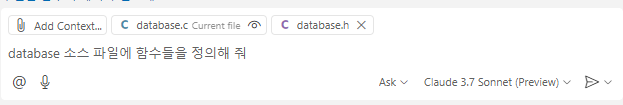

- 제안받은 내용을 확인하고, 파일에 추가합니다. <br>


## Step 4: Book 모듈 생성

- 다음으로로 Book, Member, Loan 모듈을 차례로 생성합니다. <br>
  
- `include` 디렉토리 내에, `book.h`파일을 생성합니다. <br>

- Copilot Chat의 `Ask` 모드에서 `Book 헤더 파일에 함수들을 선언해 줘` 라고 요청합니다. <br>
  
- 제안받은 내용을 확인하고, 파일에 추가합니다. <br>
  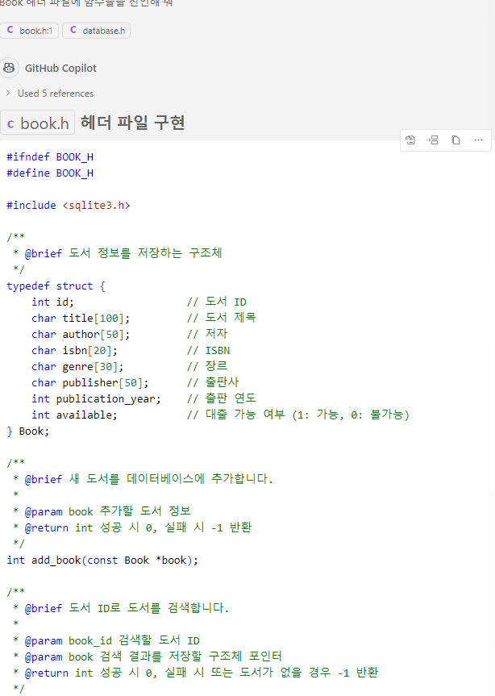

- `src` 디렉토리에 `book.c`파일을 생성합니다. <br>
- Copilot Chat에 '`Book 소스 파일에 함수들을 정의해 줘`' 라고 요청합니다. 이 때, 위에서 작성된 `book.h`파일을 드래그하여 채팅장에 붙여 넣습니다.<br>

- 제안받은 내용을 확인하고, 파일에 추가합니다. <br>
  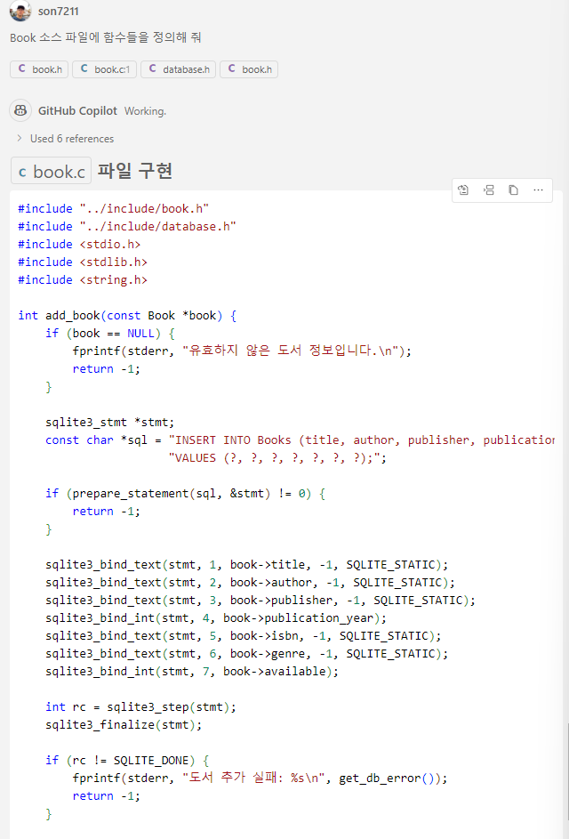

## Step 5: Member 모듈 생성

- 이번에는 <span style="color:red">**Copilot Edit**</span>을 활용하여 Member 헤더파일과 소스파일을 한꺼번에 생성해 봅니다. <br>
  
- 각각 `member.h`파일과 `member.c`파일을 생성합니다. <br>

- Copilot Chat을 '`Edit`' 모드로 변경합니다. <br>
  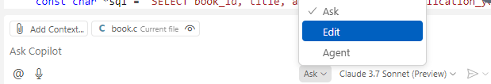

- `member.h`와 `member.c`파일을 드래그하여 채팅창에 붙여 넣습니다. <br>

- 채팅창에 '`member 모듈의 함수들을 정의해 줘`'라고 요청합니다. <br>
  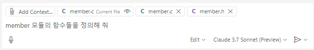

- Copilot Edit이 자동으로 파일에 코드를 작성합니다. <br>
  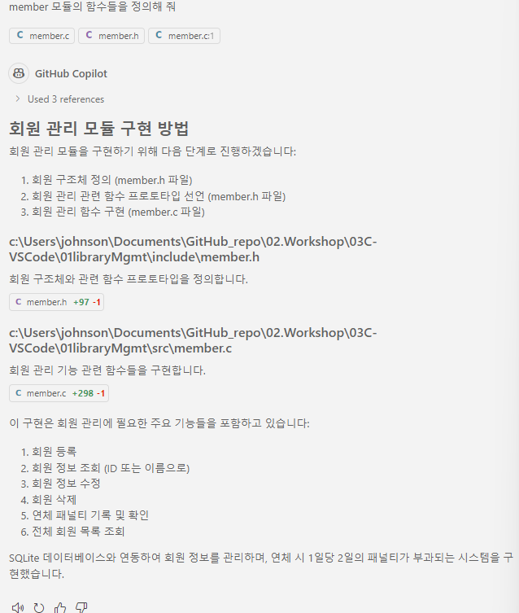

- 파일들에 코드를 확인/필요한 경우 수정하고, 'Keep'버튼을 눌러 변경사항을 유지합니다. <br>
  

- 변경된 파일들을 저장합니다. <br>
  

## Step 6: Loan 모듈 생성

- 이번에는 <span style="color:red">**Copilot Agent**</span>을 활용하여 Loan 헤더파일과 소스파일을 한꺼번에 생성해 봅니다. <br>

- Copilot Chat을 'Agent' 모드로 변경합니다. <br>
  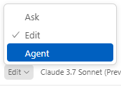

- Agent모드에서 `Loan 모듈을 생성해줘` 등과 같이 요청합니다. <br>
  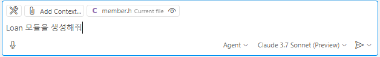

- 생성된 Loan 모듈의 내용을 확인하고 필요한 경우 수정합니다.
  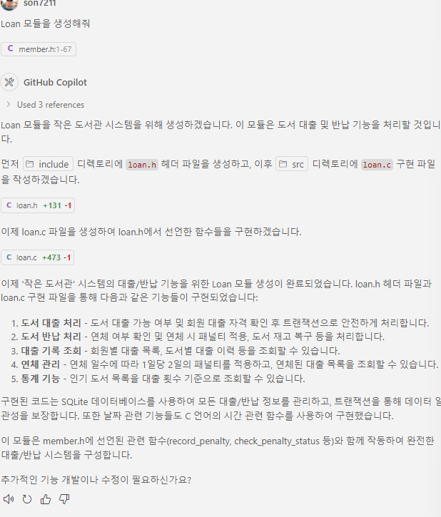

- 변경된 파일들을 저장합니다. <br>

## Step 7: main 함수 생성

- 이번에는 Agent 모드에서 `#`키워드를 활용하여 **`#codebase`** 기능을 추가로 활용해 봅니다. <br>

  - [`#codebase`는 파일들을 Chat에 수동으로 추가하는 대시, Copilot이 관련된 파일들을 코드베이스에서 찾아 자동으로 추가하도록 하는 기능](https://code.visualstudio.com/docs/copilot/chat/copilot-chat-context#_let-copilot-find-the-right-files-automatically)입니다. <br>
  - 관련된 파일이 어떤 것일지 잘 모르는 경우 특히 유용하게 활용할 수 있습니다. <br>
   
- `#codebase` 를 활용하기 위해서는 `Ctrl + Shift + P`를 눌러 명령어 팔레트를 열고, `Preferences: Open Settings(UI)`에서 `codesearch`로 검색하면 나오는 아래와 같은 설정메뉴에서, 체크박스가 활성화 되어 있어야 합니다. <br>
  

- Agent모드에서 #키를 입력하면 아래와 같이 다양한 옵션들이 나타납니다. 옵션들 중 'codebase'를 선택합니다. <br>
  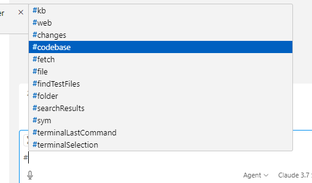

- Copilot에게 `main 함수를 생성해줘` 라고 요청합니다. <br>
  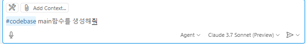

- Copilot이 코드베이스를 검색하고, 파일 및 코드 생성 내용을 확인합니다. <br>
  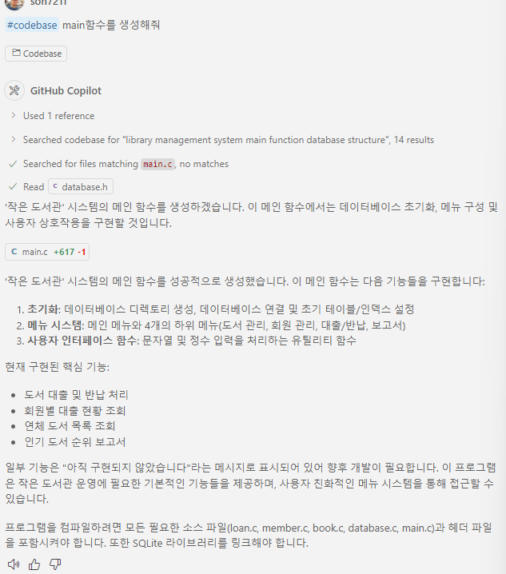


## Step 8: Makefile 생성

- Agent모드에서 `Makefile을 생성해줘` 라고 요청합니다. <br>
  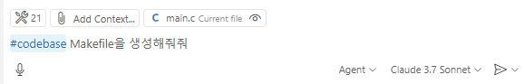
  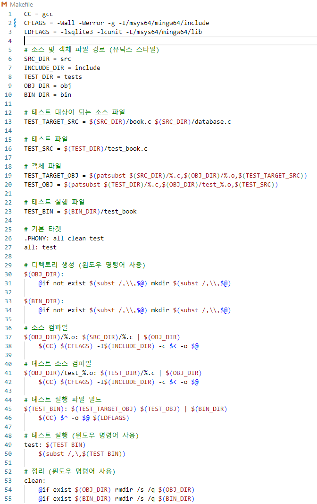

## Step 9: 저장
- `Ctrl + Shift + P`를 눌러 명령어 팔레트를 열고, `File: Save All Files`를 선택합니다. <br>
  


