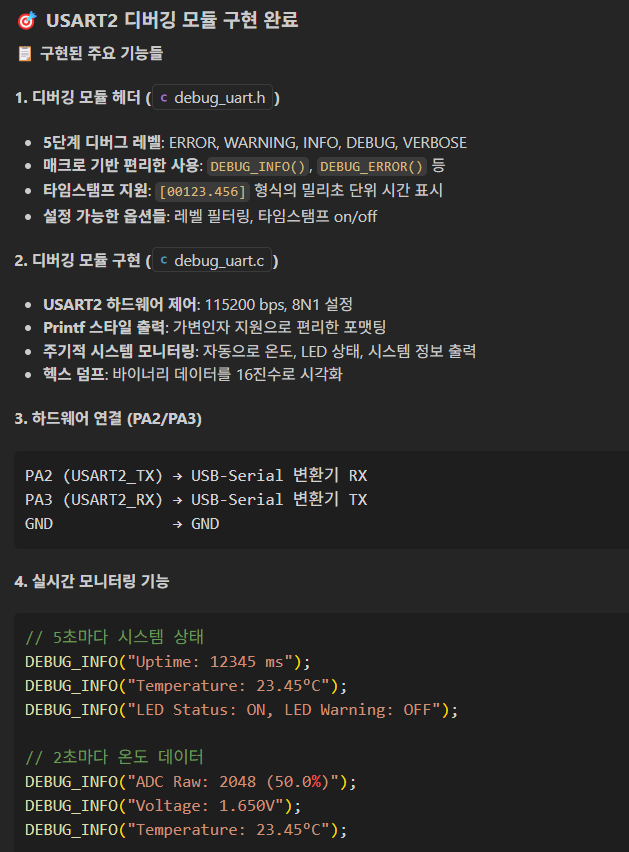
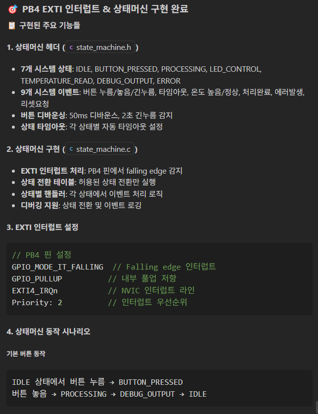

# Task 5: 임베디드 MCU 개발 활용 실습
 
## Use case: 
- GitHub Copilot을 활용하여 임베디드 MCU 개발 환경에서 코드를 제안받는 실습입니다.
- STM32CubeIDE를 사용하여 STM32F4 MCU를 위한 간단한 LED 토글 프로그램을 작성합니다.
- Copilot을 통해 HAL 라이브러리를 활용한 코드 제안을 받고, 이를 통해 MCU 개발에 Copilot을 어떻게 활용할 수 있는지 익힙니다.


## 목표:
- 

## Step 1: 준비
- 실습을 위해 아래 준비된 저장소를 다운로드 합니다. 
  - https://github.com/Kor-GHCPWorkshop/copilotWorkshop-emb-start
  - 'Code' 버튼을 클릭하고, 'Download ZIP'을 선택하여 저장소를 다운로드합니다. <br>
   <br>

- 다운로드한 ZIP 파일을 압축 해제하고, VS Code에서 열어줍니다.

- 위 저장소는 Visual Studio Code를 활용하여 STM32F100 마이크로컨트롤러 기반 임베디드 시스템을 개발하는 방법을 학습하기 위한 실습용 프로젝트입니다.
  - MCU 제조사의 기본적인 하드웨어 드라이버와 HAL(Hardware Abstraction Layer) 라이브러리가 포함되어 있습니다.

## Step 2: 
- 다운로드 받은 프로젝트의 예시로 제공된 `copilot-instructions.md` 파일을 열어봅니다. 

- Agent모드에서 아래 프롬프트를 사용해 Copilot에게 코드를 제안 받아 봅니다. 

  ```
  아래와 같이 센서와 LED를 연결 한다.

	- 온도센서 데이터핀: PA5 (GPIO)
	- 경고 LED: PB7 (Digital Output)
	- 상태 LED: PB6 (Digital Output)
	- 온도 센서에 온도가 Low이면 상태 LED를 ON, 경고 LED Off.
	- 온도 센서에 High 온도가 들어오면 경고 LED를 ON하고, 상태 LED를 Off한다.

  이러한 로직을 위해, 센서와 LED를 핀에 알맞게 구성하고, 초기화, 제어 프로토콜, CRC검증, 모니터링과 필요한 로직에 대한 코드를 생성해줘.
  ```
 <br>
  <br>
  <br>
  <br>
  <br>

## Step 3: 추가 기능 구현
- Agent모드에서 Copilot이 제안한 코드를 기반으로, 아래와 같은 기능을 추가로 구현해 봅니다.

### PWM 확장
`@workspace TIM4를 사용해서 PB6, PB7 핀에 PWM 출력을 생성하는 코드를 만들어줘`
 
  - @workspace는 현재 워크스페이스 전체를 참조하기 위한 키워드 입니다. 상세 설명은 [Task 7](../Task07/README.md)에서 다룹니다.
  - 참고: TIM4는 STM32F4 MCU에서 PWM 출력을 생성하는 데 사용되는 타이머입니다. PB6와 PB7 핀은 PWM 출력에 사용될 수 있습니다. Copilot은 이 정보를 바탕으로 적절한 HAL 라이브러리 함수를 제안할 것입니다. <br>
  <br>
   <br>
   <br>
 
### ADC 확장  
`@workspace PA5 핀을 ADC1_CH5로 설정하고 온도 센서 아날로그 값을 읽는 함수를 추가해줘` <br>
  - PA5 핀은 STM32F4 MCU에서 ADC1_CH5로 설정되어 온도 센서의 아날로그 값을 읽는 데 사용됩니다. Copilot은 이 정보를 바탕으로 적절한 HAL 라이브러리 함수를 제안할 것입니다. <br>
   <br>
   <br>
 
### UART 추가
`@workspace USART2를 사용해서 시스템 상태를 출력하는 디버깅 모듈을 만들어줘` <br>
  - USART2는 STM32F100 마이크로컨트롤러에 내장된 Universal Synchronous/Asynchronous Receiver Transmitter 2 하드웨어 모듈입니다. Copilot은 이 정보를 바탕으로 적절한 HAL 라이브러리 함수를 제안할 것입니다. <br>
   <br>

### 버튼 인터럽트
`@workspace PB4 핀에 EXTI 인터럽트를 설정하고 상태머신을 구현해줘` <br>
  <br>


