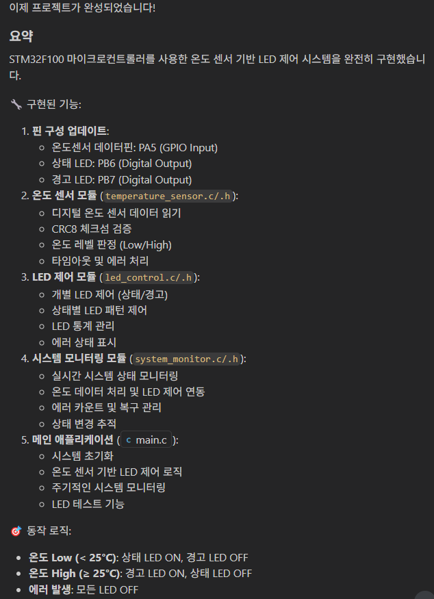
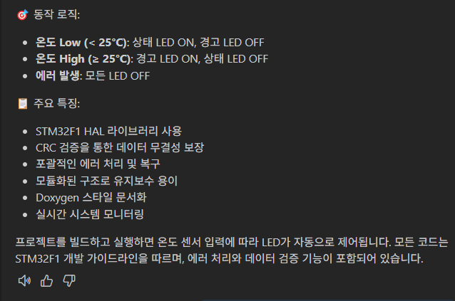
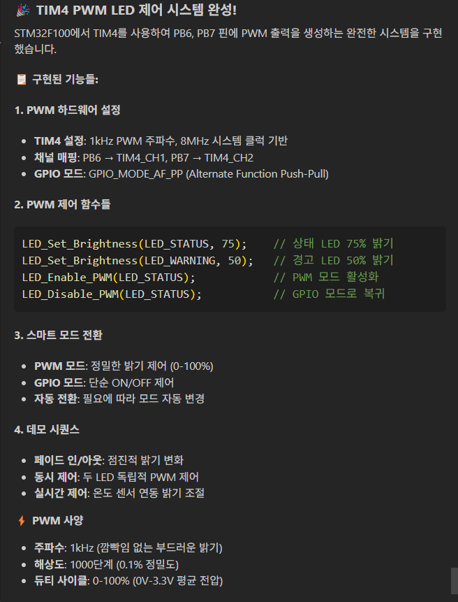
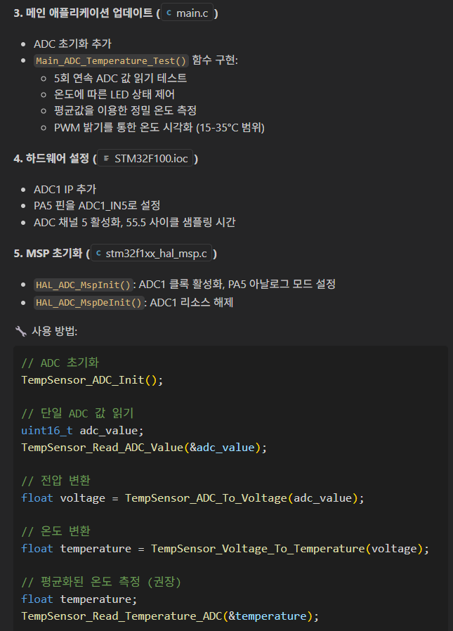

# Task 5: 코드 리뷰와 리팩토링에 대한 Copilot 활용

## Use case: 
- Copilot을 이용해 코드 리뷰를 받고, 리팩토링을 진행합니다.

## 목표:
 - Prompt파일을 이용해 코드 리뷰를 위해 Copilot에게 Custom instruction을 활용하는 방법을 익힙니다.  
 - @workspace를 활용하는 질문을 사용해 봅니다. 
 - 코드 리팩토링과, 새로운 모듈 생성에 대한 Prompt 파일을 생성하고, Copilot에게 코드 리팩토링을 요청하여 새로운 모듈 생성을 진행해 봅니다. 

## Step 1: 프롬프트 파일 생성 - 재활용 가능한 프롬프트 지시문

- **[Prompt 파일 이란?](https://code.visualstudio.com/docs/copilot/copilot-customization#_reusable-prompt-files-experimental)**
  - Prompt 파일은 재사용 가능한 프롬프트 지시문을 Markdown 형식으로 저장해, Copilot에 손쉽게 추가 맥락을 제공할 수 있도록 도와줍니다. 예컨대 특정 아키텍처 요건, 코드 스타일 등을 이 파일에 정리해두면, 반복적인 지시사항 없이도 채팅 창에서 손쉽게 불러와 의도된 코드를 빠르게 생성할 수 있습니다.
  - Use cases:
	- 코드 생성(Code generation): 컴포넌트, 테스트, 마이그레이션 등을 재사용 가능한 프롬프트로 만들어, 예를 들어 React 폼이나 API 목업을 간편히 생성.
	- 도메인 전문 지식(Domain expertise): 보안 정책이나 컴플라이언스 확인처럼 특화된 지식을 프롬프트로 공유.
	- 팀 협업(Team collaboration): 문서나 사양을 참조해 패턴과 가이드라인을 기록.
	- 온보딩(Onboarding): 복잡한 프로세스나 프로젝트별 패턴을 단계별로 안내하는 가이드를 생성.

- VS Code의 설정에서 Prompt Files 부분을 확인합니다.  
	
	

- default 위치인 .github/prompts 디렉토리를 생성합니다.  
	

- 위 디렉토리내에 워크샵 저장소에 예시로 주어진 `src/prompt` 디렉토리의 [code_review.prompt.md](src/prompt/code_review.prompt.md), [refactor_code.prompt.md](src/prompt/refactor_code.prompt.md), [create_module.prompt.md](src/prompt/create_module.prompt.md) 파일의 내용을 붙여 넣습니다.  
	

## Step 2: 프롬프트 파일을 활용해 예시로 주어진 코드의 리팩토링
- `src` 디렉토리에 있는 `loan.c`, `loan.h` 파일을 열고, 공통되는 함수들을 `utils.c`, `utils.h` 파일로 분리하도록 리팩토링을 요청합니다.   
- 자유롭게 `Agent`, `Edit`, `Ask` 모드를 활용합니다다.  
- `loan.c`, `loan.h` 파일을 드래그하여 Copilot Chat에 끌어다 놓습니다.  
  
- Chat창에 `클립 모양 아이콘`을 클릭하고 prompt 파일 (refactor_code.prompt.md, create_module.prompt.md)을 선택합니다.  
  

- 날짜관련 함수를 분리하도록 리팩토링을 요청합니다.  
  

- 프롬프트 예시 : `loan.c의 날짜 관련 함수들을 별도의 utils 모듈로 분리해서 리팩토링 해줘`  

- 제안되는 내용과 개선 코드를 확인합니다.  
  

## Step 3: 변경 내용에 대한 영향 분석을 Copiot에게 질문하기 

- 리팩토링으로 인한 코드 변경 사항에 대해 코드의 다른 부분에 어떤 영향이 있을지를 Copilot에게 질문하고 관련된 코드를 제안받습니다.  

- Copilot `Ask` 모드로 변경합니다.  
  
- Copilot chat에서 `@workspace`를 입력하고, 변경사항으로 코드에 어떤 영향이 있을지 질문 합니다.  
  

- 참고: `@workspace`는 Ask 모드에서 사용자가 질문한 내용에 대해 전체 코드베이스에서 관련된 파일들과 심볼들을 검색하고, 이것들을 답변에 참조합니다.  
  - [VS Code @worksapce 설명문서](https://code.visualstudio.com/docs/copilot/reference/workspace-context)

  - @worspace는 
    - 먼저, @workspace는 사용자 질문에 답변하는 데 필요한 정보를 파악합니다. 여기에는 대화 기록, 작업 공간 구조, 현재 선택된 코드 등이 포함됩니다.

    - 다음으로, 다양한 방법으로 컨텍스트를 수집합니다. 로컬 검색이나 GitHub 코드 검색을 통해 관련 코드 조각을 찾거나, VS Code의 언어 IntelliSense를 활용하여 함수 시그니처, 매개변수 등의 세부 정보를 추가합니다.

    - 마지막으로, 이 컨텍스트는 GitHub Copilot이 질문에 답변하는 데 사용됩니다. 컨텍스트가 너무 크면 가장 관련성 높은 부분만 사용됩니다. 응답에는 파일, 파일 범위, 심볼에 대한 참조가 표시됩니다. 이를 통해 채팅 응답에서 코드베이스의 해당 정보로 직접 연결할 수 있습니다. Copilot에 제공된 코드 조각은 응답의 참조로 나열됩니다.
	
  - `@workspace`가 사용하는 소스
	- All [indexable files](https://code.visualstudio.com/docs/copilot/reference/workspace-context#_what-content-is-included-in-the-workspace-index) in the workspace, except for files that are ignored by a .gitignore file
	- Directory structure with nested folder and file names
	- GitHub's code search index, if the workspace is a GitHub repository and indexed by code search
	- Symbols and definitions in the workspace
	- Currently selected text or visible text in the active editor

  - `@workspace`를 활용하면, 
    - 코드 검색
	- 복잡한 코드 편집에 대한 플래닝
	- 코드 베이스의 구조나 기능 구현된 것에 대한 상위 수준의 질문

- Copilot이 제안하는 내용을 확인합니다.  
  
  `  

## Step 4: 성능 관점에서 리팩토링 요청
- src 디렉토리에 있는 `getDiscount.c` 파일을 열고, 성능 관점에서 리팩토링을 요청합니다.  
- 자유롭게 `Agent`, `Edit`, `Ask` 모드를 활용 합니다.  
- Chat에서 `#file`을 입력하고, `getDiscount.c` 파일을 선택합니다.  

- 프롬프트 예시: `파일의 성능 관점에서 개선점을 제안해줘`  

- 제안되는 내용과 개선 코드를 확인합니다. 
  

## Step 5: 보안 문제점 분석에 대한 개선 요청

- `src` 디렉토리에 있는 `vulnerable_server.c` 파일을 열고, 보안 문제점을 확인하고, 개선 방법을 요청합니다.  
- 자유롭게 `Agent`, `Edit`, `Ask` 모드를 활용 합니다.  
- Chat에서 `#file`을 입력하고, `vulnerable_server.c` 파일을 선택합니다.  

- 프롬프트 예시: `파일의 보안 문제점을 분석하고 개선할 부분을 제안해줘`

- 제안되는 내용과 개선 코드를 확인합니다.  
  

## Step 6: 프롬프트 파일을 활용해 코드 리뷰 요청
- 생성된 코드에 대해 프롬프트 파일을 활용해 코드 리뷰를 요청합니다.  
- `Agent`, `Edit`, `Ask` 모드 어느것을 활용해도 되지만, 일단 질문을 위해 Ask 모드를 선택합니다.  
- Chat창에 `클립 모양 아이콘`을 클릭하고 Prompt를 선택하여 code_review.prompt.md 파일을 선택합니다.  
  
  
- 프롬프트 입력할 필요없이 바로 화살표 버튼을 클릭하여 요청합니다. 
  

- 제안되는 내용과 개선 코드를 확인합니다.  
  
  

## 추가자료
  - [다양한 GitHub Copilot 사용에 대한 가이드](https://docs.github.com/ko/enterprise-cloud@latest/copilot/using-github-copilot/guides-on-using-github-copilot)
  - [GitHub Copilot을 이용해 리팩토링 하는법](https://github.blog/ai-and-ml/github-copilot/how-to-refactor-code-with-github-copilot/)
  - [GitHub Copilot과 함께 디버그](https://github.blog/ai-and-ml/github-copilot/how-to-debug-code-with-github-copilot/)
  - [10 Unexpected Ways to Use Github Copilot](https://github.blog/2024-01-22-10-unexpected-ways-to-use-github-copilot/)

## 지식 확인
- Copilot을 이용한 리팩토링
- `@workspace`의 활용
- Prompt 파일의 활용

