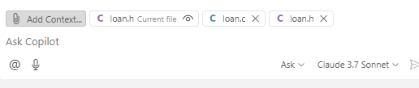
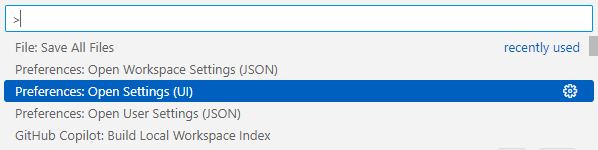
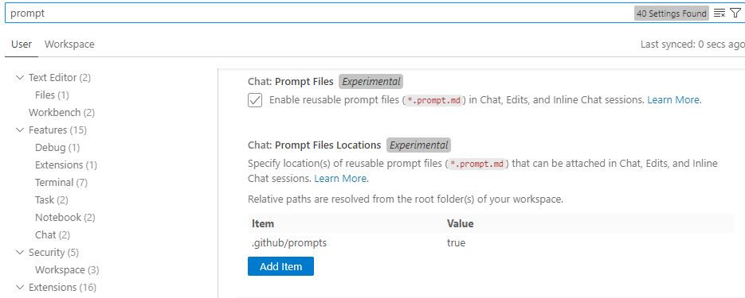
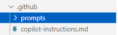
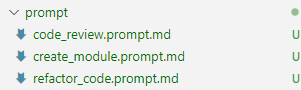
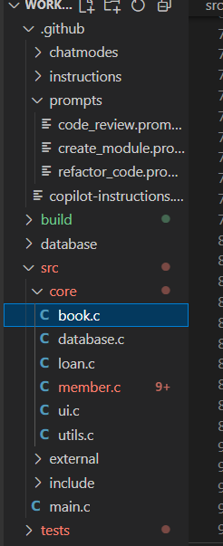
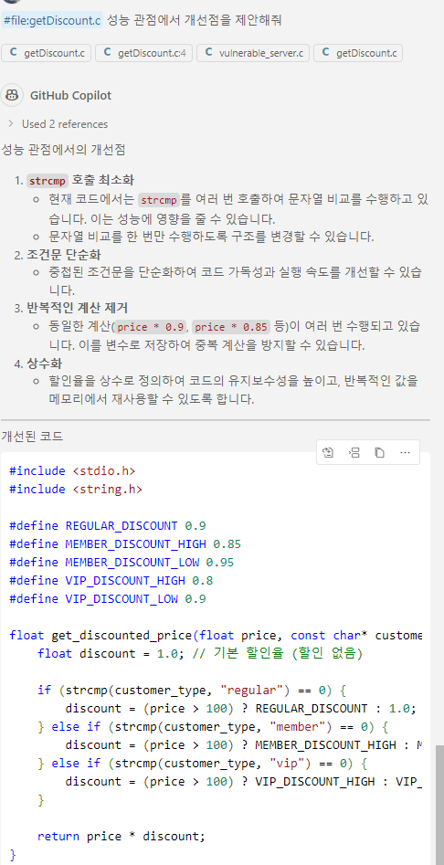
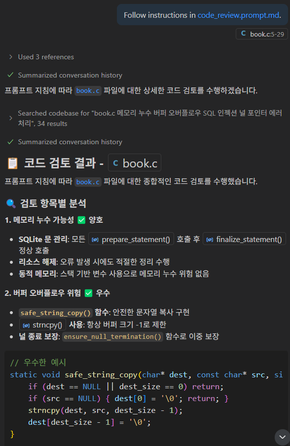

# Task 6: 코드 리뷰와 리팩토링에 대한 Copilot 활용

## Use case: 
- Prompt 파일에 대해 알아보고, 프롬프트 파일을 생성하여 코드 리뷰를 받고, 리팩토링에 활용해 봅니다. 
- 효율적인 프롬프트 작성과 컨텍스트 활용 방법을 익힙니다. 
- Copilot Chat에 추가할 수 있는 다양한 컨텍스트들에 대해 확인합니다. 
- Copilot을 활용해 Commit message를 자동 생성합니다.

## 목표:
- prompt 파일을 생성하여, 활용 방법을 실습합니다.
- 효율적인 프롬프트 작성과 컨텍스트 활용을 통해 Copilot을 활용하는 방법을 익힙니다.
- Copilot Chat에 추가할 수 있는 다양한 컨텍스트들에 대해 확인합니다. 
- Commit message 자동 생성 기능을 사용해 보고, Custom instruction을 제공하여, 원하는 형태로 commit message를 제안받아 봅니다. 

## Step 1: 리팩토링 활용
- `src` 디렉토리에 있는 `loan.c`, `loan.h` 파일을 다운로드하여 워크스페이스에서 열고, 공통되는 함수들을 `utils.c`, `utils.h` 파일로 분리하도록 리팩토링을 요청합니다.   
- `loan.c`, `loan.h` 파일을 드래그하여 Copilot Chat에 끌어다 놓습니다.  
    

- 날짜관련 함수를 분리하도록 리팩토링을 요청합니다.  

- 프롬프트 예시 : `loan.c의 날짜 관련 함수들을 별도의 utils 모듈로 분리해서 리팩토링 해줘`  

- 제안되는 내용과 개선 코드를 확인합니다.  
  

## Step 2: 프롬프트 파일 - 재활용 가능한 프롬프트 지시문

- **[Prompt 파일 이란?](https://code.visualstudio.com/docs/copilot/copilot-customization#_prompt-files-experimental)**
  - 프롬프트 파일은 `.prompt.md` 확장자를 가진 Markdown 파일로 정의되며, 코드 생성이나 코드 리뷰 수행과 같은 일반적인 작업을 위한 재사용 가능한 프롬프트입니다. 프롬프트 파일은 독립적인 프롬프트로, 채팅에서 직접 실행할 수 있습니다. 선택적으로 작업 수행 방법에 대한 지침을 포함할 수도 있습니다.

  - 프롬프트 파일은 instruction 파일을 활용하여 일반적인 가이드를 재사용하고 작업별 지침을 프롬프트에 포함할 수 있습니다. 예를 들어, 보안 리뷰 프롬프트 파일은 일반적인 보안 관행을 설명하는 사용자 정의 지침을 참조하면서, 리뷰 결과를 보고하는 방법에 대한 특정 지침을 포함할 수 있습니다.

### 프롬프트 파일 위치
  - 프롬프트 파일은 `.github/prompts` 디렉토리 또는 사용자 지정에 의한 다른 디렉토리에 저장할 수 있습니다.

### 프롬프트 파일 구조
- 메타데이터 헤더
  - `mode`: 프롬프트 파일에 대한 간단한 설명입니다. 이 설명은 프롬프트 입력 필드의 자리 표시자 텍스트로 표시되며, 프롬프트 파일 드롭다운 목록에서 해당 프롬프트 위에 마우스를 올릴 때 표시됩니다.
  - `model`: 프롬프트를 실행할 때 사용할 AI 모델입니다. 지정하지 않으면 모델 선택기에서 현재 선택된 모델이 사용됩니다.
  - `tools`: Agent모드에서 사용할 수 있는 도구 또는 도구 세트의 목록입니다. 여기에는 기본 제공 도구, 도구 세트, MCP 도구 또는 확장 프로그램에서 제공하는 도구가 포함될 수 있습니다. 먼저, Agent모드의 '도구모양 아이콘'(Configure Tools)에서 사용할 도구들을 선택합니다. 프롬프트 파일을 실행할 때, 프롬프트 파일내에 지정된 도구가 Configure Tools에서 지정되어 있지 않다면, 해당 도구는 무시됩니다. 
  - `description`: 프롬프트에 대한 설명.

- Body with prompt content
  - 프롬프트 파일은 채팅에서 작성 프롬프트의 형식을 모방합니다. 이를 통해 자연어 지침, 추가 컨텍스트를 혼합하거나 다른 프롬프트 파일을 종속성으로 연결할 수 있습니다. Markdown 형식을 사용하여 프롬프트 콘텐츠를 구조화할 수 있으며, 여기에는 제목, 목록, 코드 블록 등이 포함됩니다.
  - 워크스페이스 파일, 프롬프트 파일, 또는 지침 파일을 Markdown 링크를 사용하여 참조할 수 있습니다. 이러한 파일을 참조할 때는 상대 경로를 사용하고, 프롬프트 파일의 위치를 기준으로 경로가 올바른지 확인해야 합니다.
  - 프롬프트 파일 내에서, `${variableName}` syntax를 활용해 다양한 변수들을 참조할 수 있습니다. :

	- Workspace variables - ${workspaceFolder}, ${workspaceFolderBasename}
	- Selection variables - ${selection}, ${selectedText}
	- File context variables - ${file}, ${fileBasename}, ${fileDirname}, ${fileBasenameNoExtension}
	- Input variables - ${input:variableName}, ${input:variableName:placeholder} (pass values to the prompt from the chat input field)

### 프롬프트 파일 예시
  - [예시 링크](https://code.visualstudio.com/docs/copilot/copilot-customization#_prompt-file-examples)

### 프롬프트 파일 생성
- VS Code의 설정에서 Prompt Files 부분을 확인합니다.  
	
	

- default 위치인 .github/prompts 디렉토리를 생성합니다.  
	

- 혹은, Copilot Chat 우측 상단의 톱니 바퀴 버튼을 누르고 생성합니다.  
- 현재 디렉토리내에 예시로 주어진 `src/prompt` 디렉토리의 [code_review.prompt.md](src/prompt/code_review.prompt.md), [refactor_code.prompt.md](src/prompt/refactor_code.prompt.md), [create_module.prompt.md](src/prompt/create_module.prompt.md) 파일의 내용을 붙여 넣습니다.  
    

### 프롬프트 파일 실행
- [Prompt files를 실행하는 방법](https://code.visualstudio.com/updates/v1_100#_prompt-files)은 3가지가 있습니다.  
	- Copilot Chat에서 '`/`'를 입력하고 Prompt파일 선택.  
	- Prompt 파일을 열고 우측 상단의 'Play' 버튼을 클릭합니다.  
	- Ctrl + Shift + P를 눌러 명령어 팔레트를 열고, `Chat: Run Prompt File..`을 선택합니다. 

## Step 3: 프롬프트 파일을 활용해 예시로 주어진 코드의 리팩토링
- `book.c` 파일을 선택합니다. 
- Copilot Chat에서 '/'를 입혁하고, `refactor_code.prompt.md` 파일을 선택합니다.  
    
    
    

## Step 4: 변경 내용에 대한 영향 분석을 Copilot에게 질문하기 

- 리팩토링으로 인한 코드 변경 사항에 대해 코드의 다른 부분에 어떤 영향이 있을지를 Copilot에게 질문하고 관련된 코드를 제안받습니다.  

- Copilot `Ask` 모드로 변경합니다.  
  
- Copilot chat에서 `@workspace`를 입력하고, #`changes` 를 사용 변경사항으로 코드에 어떤 영향이 있을지 질문 합니다.  
  

- 참고: `@workspace`는 Ask 모드에서 사용자가 질문한 내용에 대해 전체 코드베이스에서 관련된 파일들과 심볼들을 검색하고, 이것들을 답변에 참조합니다. (상세설명은 다음 Task06에서 다룹니다.)  

- Copilot이 제안하는 내용을 확인합니다.  
    
     

## Step 5: 성능 관점에서 리팩토링 요청
- src 디렉토리에 있는 `getDiscount.c` 파일을 열고, 성능 관점에서 리팩토링을 요청합니다.  
- 자유롭게 `Agent` 모드를 활용 합니다.  
- Chat에서 `#file`을 입력하고, `getDiscount.c` 파일을 선택합니다.  

- 프롬프트 예시: `파일의 성능 관점에서 개선점을 제안해줘`  

- 제안되는 내용과 개선 코드를 확인합니다. 
  

## Step 6: 보안 문제점 분석에 대한 개선 요청

- `src` 디렉토리에 있는 `vulnerable_server.c` 파일을 열고, 보안 문제점을 확인하고, 개선 방법을 요청합니다.  
- 자유롭게 `Agent`, `Edit`, `Ask` 모드를 활용 합니다.  
- Chat에서 `#` 을 입력하고 파일명을 입력하여 `#vulnerable_server.c` 파일을 선택합니다.  

- 프롬프트 예시: `파일의 보안 문제점을 분석하고 개선할 부분을 제안해줘`

- 제안되는 내용과 개선 코드를 확인합니다.  
    

## Step 7: 프롬프트 파일을 활용해 코드 리뷰 요청
- 생성된 코드에 대해 프롬프트 파일을 활용해 코드 리뷰를 요청합니다.  
- 질문을 위해  `Ask` 모드를 선택합니다.  
- book.c 파일을 선택합니다.  
- Chat창에 /를 입력하고 `code_review.prompt.md`를 선택하고 실행합니다.  
    
  
- 제안되는 내용과 개선 코드를 확인합니다.  
    
    
    

## 추가자료
  - [다양한 GitHub Copilot 사용에 대한 가이드](https://docs.github.com/ko/enterprise-cloud@latest/copilot/using-github-copilot/guides-on-using-github-copilot)
  - [GitHub Copilot을 이용해 리팩토링 하는법](https://github.blog/ai-and-ml/github-copilot/how-to-refactor-code-with-github-copilot/)
  - [GitHub Copilot과 함께 디버그](https://github.blog/ai-and-ml/github-copilot/how-to-debug-code-with-github-copilot/)
  - [10 Unexpected Ways to Use Github Copilot](https://github.blog/2024-01-22-10-unexpected-ways-to-use-github-copilot/)

## 지식 확인
- Copilot을 이용한 리팩토링
- Prompt 파일의 활용

