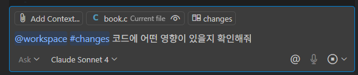
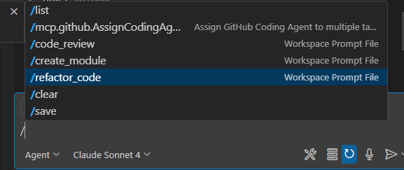
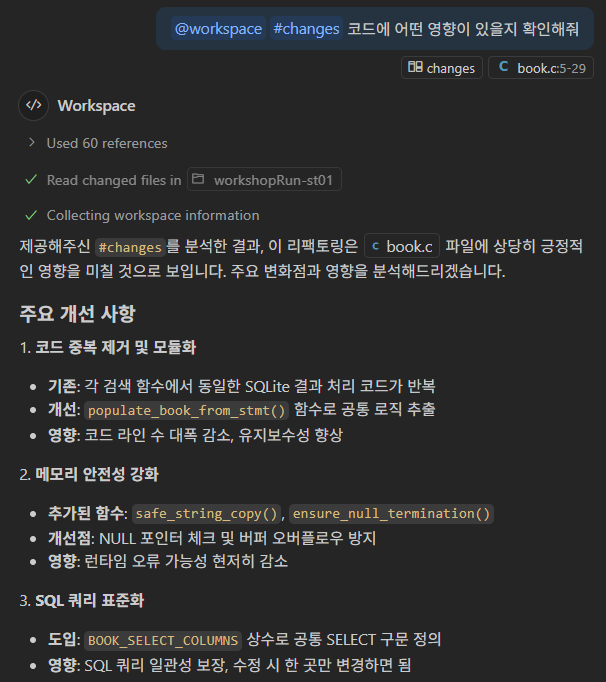
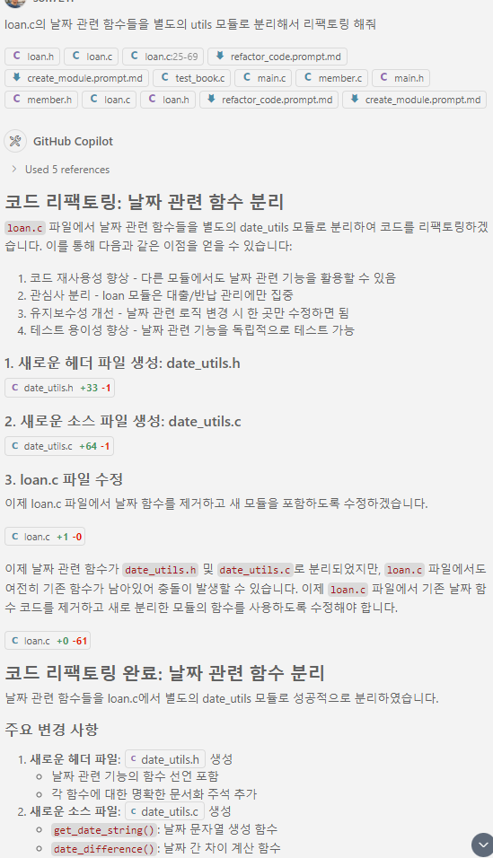
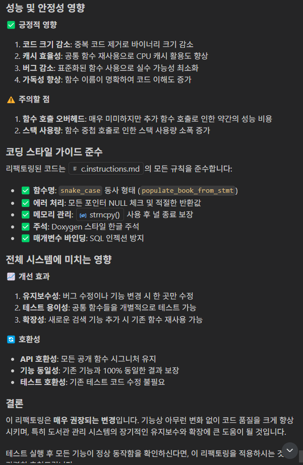
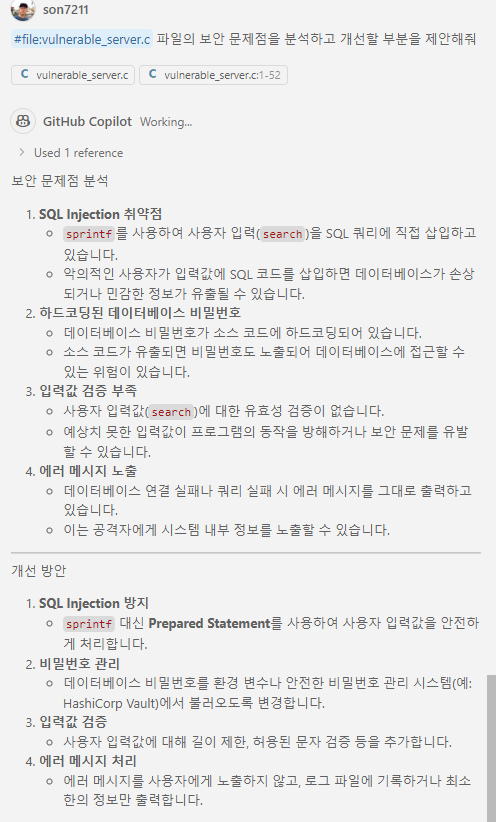
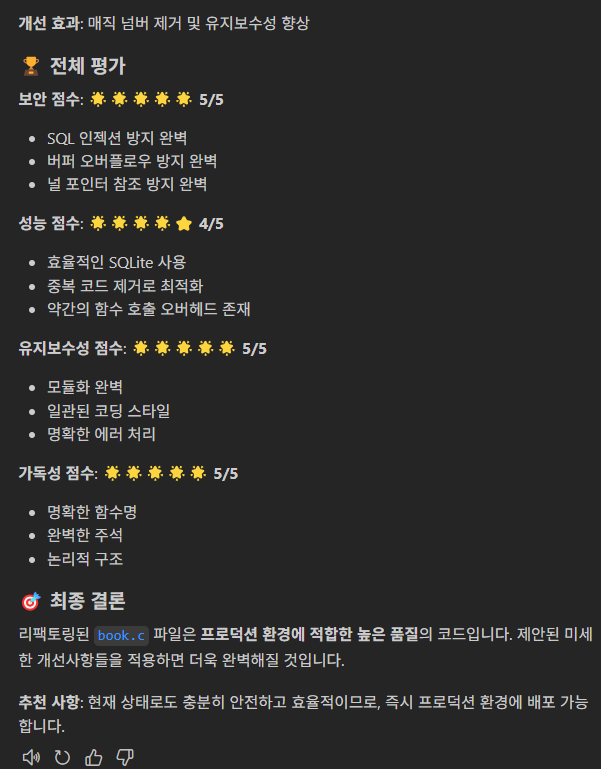
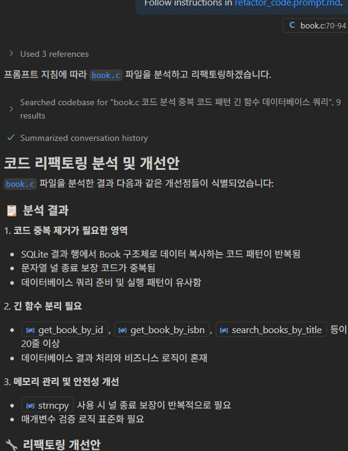

# Task 6: Copilot Extension 실습

## Use case: 
- GitHub Copilot의 Extension을 실습해 봅니다. 

- **본 실습에서는 Node.js를 사용합니다.** 
  - [Node.js 설치](https://nodejs.org/ko/download)가 필요합니다. 

## 목표:
- GitHub Copilot의 Extension을 활용하는 실습을 진행합니다.
- GitHub Copilot의 Extension의 2가지 생성 방법(Skillset, Agent)을 이해하고, 실습을 진행합니다.

## Step 1: 내부 문서 API를 활용한 Skillset Extension 생성 실습
- 참조 repository : https://github.com/Kor-GHCPWorkshop/kordocserver_demo

- Node.js를 사용해 Express 서버를 구축하고, docs 디렉토리내에 있는 2개의 Markdown 파일을 활용하여 해당 문서를 API로 제공하는 서버를 구축합니다. 
  - 서버 구축시에도 Copilot을 활용하여 코드를 작성합니다.
  - server.js 파일을 생성하고, Express 서버 관련 코딩을 진행합니다. (Copilot 사용)
  - docs 디렉토리내에 있는 2개의 Markdown 파일을 활용하여 해당 문서를 API로 제공하는 서버를 구축합니다. (
  - 구축이 완료되면 npm start로 서버를 실행합니다. <br>
  

- 실습을 위해, Ngrok을 사용하여 로컬 서버를 외부에 노출합니다. <br>
  - [Ngrok 다운로드](https://ngrok.com/download) <br>
  - [Ngrok 설치 및 사용법](https://ngrok.com/docs) <br>
  

- GitHub.com의 개인계정에 GitHub app을 생성하고, Copilot 'Skillset' 모드로 app을 생성합니다. 
  - 개인 계정의 'Settings' > 'Developer settings' > 'GitHub Apps > New GitHub App'으로 새로운 app을 생성합니다. <br>
   
  
  - General에서 App name과 Homepage URL, Callback URL을 입력합니다. (Ngrok URL사용) <br>
    <br>

  - Account permission에서 Copilot 관련 2가지 권한을 'read-only'로 설정합니다. <br>
    <br>

  - App Type을 Skillset으로 설정합니다. <br>
    <br>
   
  - Skill definitions를 추가합니다. <br>
    <br>

  - copilot-standalone 에 대한 'Inference description'과 'Parameter'를 아래와 같이 추가하고, URL을 Ngrok으로 노출한 주소로 설정합니다. <br>    
    
	- Inference description :
	```
	Copilot Standalone에 대한 설명
	Copilot Standalone에 대한 구매절차
	Copilot Standalone 무료트라이얼 제공 여부
	Copilot Standalone 인증서버 연동에 대한 설명
    ``` 

	- URL :` https://your-ngrok-url-here/copilotstandalone`

	- Parameters :
	  
	```
	{
	"type": "object"
	}
	```
	
    

    <br>

- Save 합니다. 

- 왼편의 `Install App` 메뉴에서 Install 합니다. <br>
  

- 테스트를 위해, 별도의 VS Code를 실행하고, Copilot Chat에서 @를 타이핑하여, 방금 추가된 Copilot Extension을 확인하고, Authorization 과정을 진행합니다.<br> 
   
  

- `Ask` 모드에서 **GPT-4o** 모델을 선택합니다. <br>
   <br>

- Authorization이 완료되면, `@extenion-name`을 타이핑하고, Copilot Standalone에 대해 설명해줘 등과 같은 질문을 통해 Copilot Extension의 동작을 확인합니다. <br>
   <br>
   <br>

  - Ngrok에서 200K 회신 됩니다. <br>
   <br>

- 추가로 다른 질문도 실행해 봅니다. <br>
   <br>
   <br>

## Step 2: Agent Extension 생성 실습
- 참조 repository : https://github.com/Kor-GHCPWorkshop/gist_funcCall_demo

- 이번 실습예제는 [Function calling](https://help.openai.com/en/articles/8555517-function-calling-in-the-openai-api)을 활용하는 예제입니다. 
  - 위 1번 실습과 마찬가지로 서버를 실행하고, 이번에는 LLM이 Function call을 호출하여, 내부 서버에 있는 function을 실행하도록 합니다. 
  - Function은 Copilot으로 보내지는 Code snippet을 이용해 GitHub 사용자 계정에 Gist를 생성하는 함수 입니다. 
  - 이 Function은 3가지 파라미터가 필요합니다. 
    - File이름, Code body, Gist description
  - File이름과, code body는 Copilot이 전달하는 내용을 그대로 이용하고, Gist description은 Copilot이 전달하는 내용을 이용하여 summary 해줍니다.


- Agent Extension을 생성하기 위해, 다음 단계를 진행합니다.
   - 서버를 실행하고, Ngrok으로 외부로 포워딩 합니다. 
   - 위 Skillset Extension과 동일한 절차로 app을 생성하지만, 'Agent' 모드를 선택합니다. <br>
       <br>

   - URL과 Inference description을 설정합니다. <br>
	   <br>

   - app을 설치합니다. <br>


- 테스트를 위해, 별도의 VS Code를 실행하고, Copilot Chat에서 @를 타이핑하여, 방금 추가된 Copilot Extension을 확인하고, Authorization 과정을 진행합니다.

- Authorization이 완료되면, `@extenion-name`을 타이핑하고, create a gist 등과 같은 요청청을 통해 Copilot Extension의 동작을 확인합니다. <br>
   <br>
   <br>

- Gist가 생성되었는지 확인합니다. <br>
   <br>


## 추가 자료
- https://docs.github.com/en/copilot/building-copilot-extensions/building-a-copilot-agent-for-your-copilot-extension/using-copilots-llm-for-your-agent

- https://resources.github.com/learn/pathways/copilot/extensions/building-your-first-extension/
- https://docs.github.com/ko/copilot/customizing-copilot/extending-the-capabilities-of-github-copilot-in-your-organization